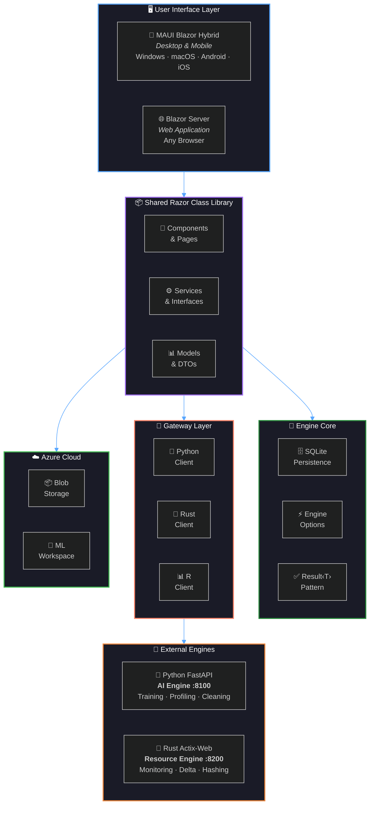
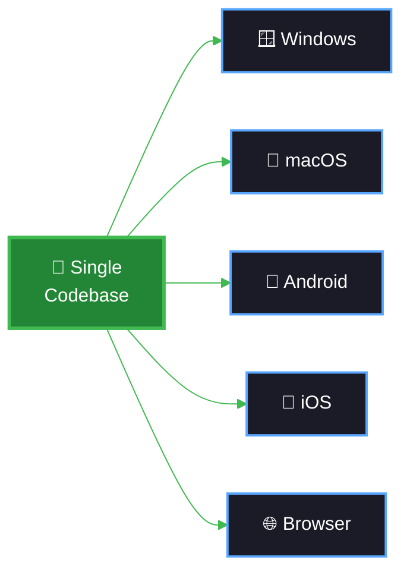
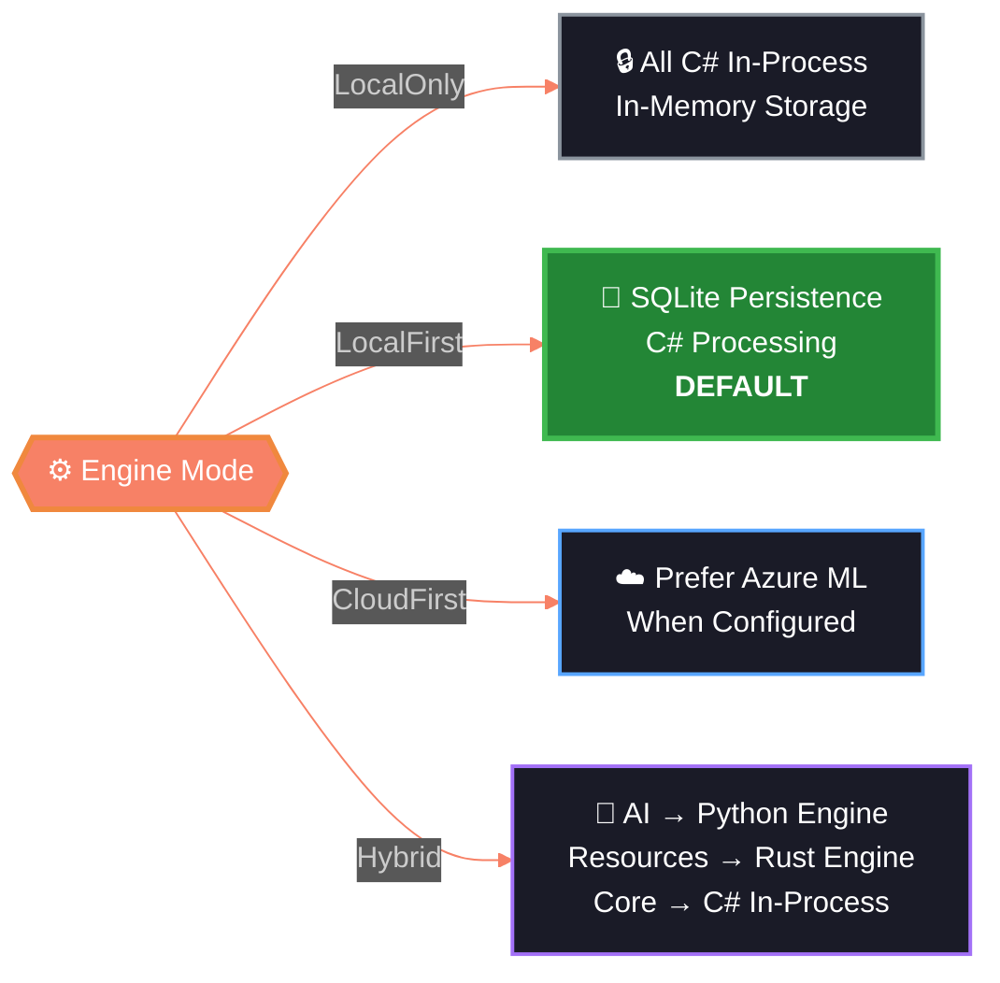
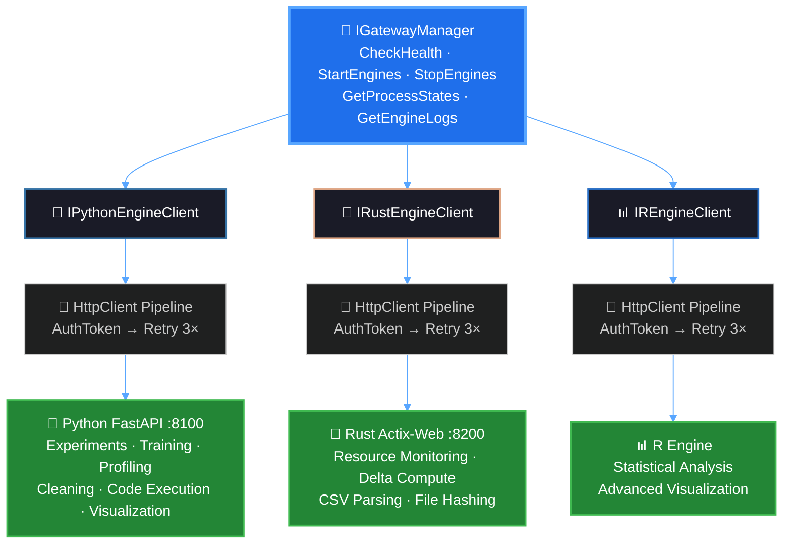
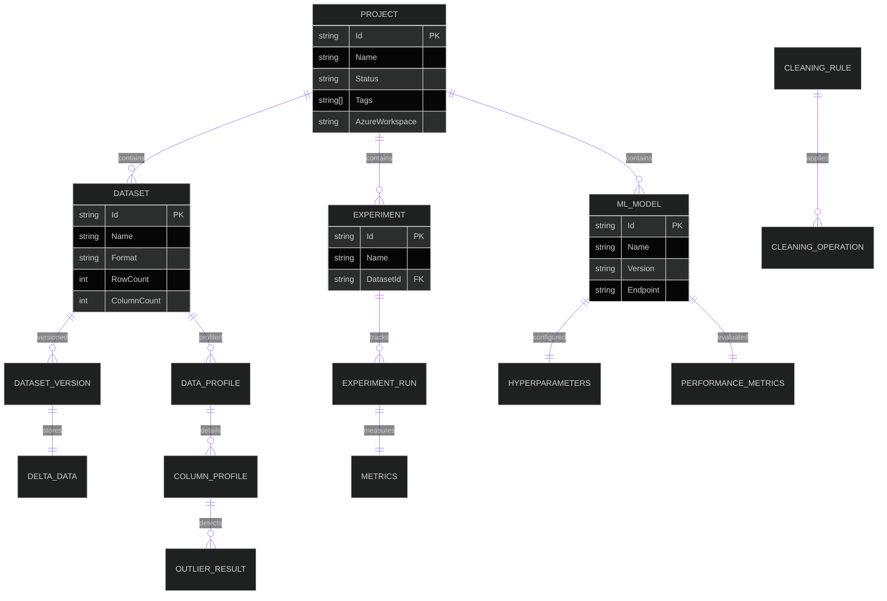
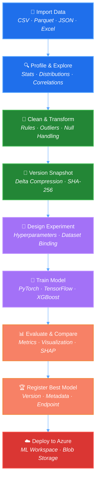

<div align="center">

<!-- ═══════════════════════════════════════════════════════════════════════ -->
<!--                     ANIMATED HERO HEADER                              -->
<!-- ═══════════════════════════════════════════════════════════════════════ -->


<!-- ═══════════════════════════════════════════════════════════════════════ -->
<!--                    ANIMATED TYPING TAGLINE                            -->
<!-- ═══════════════════════════════════════════════════════════════════════ -->

<a href="https://github.com/AIMRAN-ai/AIMRAN-DATA-SCIENCE-LAB">
  
</a>

<br/>

<!-- ═══════════════════════════════════════════════════════════════════════ -->
<!--                       BADGE RIBBON                                    -->
<!-- ═══════════════════════════════════════════════════════════════════════ -->

[](https://dotnet.microsoft.com)
[](https://dotnet.microsoft.com/apps/aspnet/web-apps/blazor)
[](https://python.org)
[](https://fastapi.tiangolo.com)
[](https://www.rust-lang.org)
[](https://pytorch.org)
[](https://www.tensorflow.org)
[](https://azure.microsoft.com)
[](https://www.sqlite.org)
[](LICENSE)

<br/>

<!-- ═══════════════════════════════════════════════════════════════════════ -->
<!--                        QUICK STATS                                    -->
<!-- ═══════════════════════════════════════════════════════════════════════ -->


</div>

<br/>

<!-- ═══════════════════════════════════════════════════════════════════════ -->
<!--                      CINEMATIC DIVIDER                                -->
<!-- ═══════════════════════════════════════════════════════════════════════ -->


<br/>

##  &nbsp;Vision

> **AIMRAN Data Science Lab** is a **full-stack data science workbench** that runs as both a
> **native desktop app** *(MAUI Blazor Hybrid — Windows / macOS / Android / iOS)* and a
> **web application** *(ASP.NET Core Blazor Server)*. A single Razor Class Library supplies
> every UI component and service — **100% code reuse** across all platforms.

<br/>

<!-- ═══════════════════════════════════════════════════════════════════════ -->
<!--                    ARCHITECTURE OVERVIEW                              -->
<!-- ═══════════════════════════════════════════════════════════════════════ -->

##  &nbsp;System Architecture

<div align="center">



</div>

<br/>


<br/>

<!-- ═══════════════════════════════════════════════════════════════════════ -->
<!--                    FEATURE SHOWCASE                                   -->
<!-- ═══════════════════════════════════════════════════════════════════════ -->

##  &nbsp;Feature Showcase

<div align="center">
<table>
<tr>
<td width="50%" valign="top">

### 🔬 Data Science Pipeline

| Feature | Description |
|:---:|:---|
| 📊 **Dashboard** | Live stats, resource meters, quick actions |
| 📁 **Dataset Manager** | Import CSV, Parquet, JSON, Excel |
| 🔄 **Version Control** | Binary delta snapshots, SHA-256 verification |
| 🧹 **Cleaning Studio** | AI-powered rule-based cleaning pipeline |
| 📈 **Profiling** | Column stats, distributions, correlations |
| 🎯 **Outlier Detection** | IQR & Z-score methods |

</td>
<td width="50%" valign="top">

### 🧠 Machine Learning

| Feature | Description |
|:---:|:---|
| 🧪 **Experiment Tracker** | Runs, hyperparameters, metrics |
| 🏗️ **Model Lab** | Train, compare, deploy models |
| 🐍 **AI Engine** | FastAPI with PyTorch & TensorFlow |
| 📦 **Plugin Hub** | pip/cargo package management |
| 📡 **Resource Monitor** | CPU, RAM, GPU, disk in real-time |
| ☁️ **Azure Integration** | Blob Storage & ML Workspace |

</td>
</tr>
</table>
</div>

<br/>

<!-- ═══════════════════════════════════════════════════════════════════════ -->
<!--                   PLATFORM SUPPORT                                    -->
<!-- ═══════════════════════════════════════════════════════════════════════ -->

<div align="center">

### 🌍 One Codebase — Every Platform



</div>

<br/>


<br/>

<!-- ═══════════════════════════════════════════════════════════════════════ -->
<!--                     PROJECT MAP                                       -->
<!-- ═══════════════════════════════════════════════════════════════════════ -->

##  &nbsp;Project Map

<div align="center">

```
AIMRAN-DATA-SCIENCE-LAB/
│
├── 🔷 AimranDataScienceLab.Engine/          ← .NET Core • SQLite persistence & engine core
│   ├── Data/
│   │   ├── DatabaseInitializer.cs           ← Schema setup & initialization
│   │   └── SqliteConnectionFactory.cs       ← Connection pool management
│   └── Engine/
│       ├── EngineOptions.cs                 ← LocalOnly │ LocalFirst │ CloudFirst │ Hybrid
│       └── EngineResult.cs                  ← Result<T> pattern for error handling
│
├── 🔷 AimranDataScienceLab.Gateway/         ← .NET Core • HTTP gateway for external engines
│   ├── Clients/
│   │   ├── PythonEngineClient.cs            ← FastAPI HTTP client
│   │   ├── RustEngineClient.cs              ← Actix-Web HTTP client
│   │   ├── REngineClient.cs                 ← R engine HTTP client
│   │   ├── EngineProcessManager.cs          ← Start/stop engine processes
│   │   ├── GatewayManager.cs                ← Orchestration facade
│   │   ├── AuthTokenDelegatingHandler.cs    ← JWT/Bearer authentication
│   │   └── RetryDelegatingHandler.cs        ← Retry logic (3× with backoff)
│   ├── Interfaces/
│   │   ├── IPythonEngineClient.cs           ← Python client contract
│   │   ├── IRustEngineClient.cs             ← Rust client contract
│   │   ├── IREngineClient.cs                ← R engine client contract
│   │   └── IGatewayManager.cs               ← Gateway manager contract
│   └── Configuration/
│       └── GatewayOptions.cs                ← Gateway settings
│
├── 🐍 ai-engine/                            ← Python FastAPI • ML/AI workload engine
│   ├── main.py                              ← FastAPI server (:8100)
│   ├── schemas.py                           ← Pydantic request/response models
│   ├── requirements.txt                     ← 58 ML/AI dependencies
│   └── routers/
│       ├── experiments.py                   ← Experiment tracking
│       ├── models.py                        ← Model management
│       ├── profiling.py                     ← Data profiling
│       ├── cleaning.py                      ← Data cleaning
│       ├── code_execution.py                ← Safe code evaluation
│       └── visualization.py                 ← Chart/plot generation
│
├── 🧪 AimranDataScienceLab.Engine.Tests.csproj  ← xUnit test project
├── 📋 AIMRAN_DATA_SCIENCE_LAB_ARCHITECTURE.md   ← Detailed architecture guide
├── 📄 LICENSE                                    ← MIT License
└── 📖 README.md                                  ← You are here!
```

</div>

<br/>

<!-- ═══════════════════════════════════════════════════════════════════════ -->
<!--                  ENGINE MODE PIPELINE                                 -->
<!-- ═══════════════════════════════════════════════════════════════════════ -->

## ⚡ Engine Modes

<div align="center">



</div>

<br/>


<br/>

<!-- ═══════════════════════════════════════════════════════════════════════ -->
<!--                 DETAILED FEATURES (COLLAPSIBLE)                       -->
<!-- ═══════════════════════════════════════════════════════════════════════ -->

##  &nbsp;Deep Dive

<details>
<summary><b>📊 Page-by-Page Feature Guide</b> &nbsp;(click to expand)</summary>

<br/>

| Route | Page | Features |
|:---:|:---|:---|
| `/` | **Dashboard** | Real-time project/dataset/experiment/model counts, live CPU/RAM/disk usage bars, quick-action buttons |
| `/projects` | **Project Management** | CRUD with status (Active/Archived/Completed), tag-based filtering, Azure workspace binding |
| `/projects/{id}` | **Project Workspace** | Unified view of datasets/experiments/models, link/unlink assets, scoped experiments |
| `/datasets` | **Dataset Manager** | Import CSV/Parquet/JSON/Excel, row/column counts, preview first N rows, format detection |
| `/versioning` | **Dataset Versioning** | Point-in-time snapshots, binary delta compression, SHA-256 verification, diff visualization |
| `/data-cleaning` | **Cleaning Studio** | Column-level profiling, outlier detection (IQR/Z-score), rule-based pipeline, before/after comparison |
| `/experiments` | **Experiment Tracker** | Create experiments, track runs with hyperparameters, compare metrics, submit to AI engine |
| `/models` | **Model Lab** | Register models, version management, performance comparisons, deploy to Azure ML |
| `/ai-engine` | **AI Engine Manager** | Health status, start/stop engines, stream real-time logs, process monitoring |
| `/plugins` | **Plugin Hub** | Browse pip/cargo packages, install/upgrade/uninstall, model version registry |
| `/resources` | **Resource Monitor** | Live CPU per core, RAM used/available, disk I/O, GPU detection via Rust engine |
| `/azure` | **Azure Integration** | Configure subscription, test connectivity, upload to Blob, submit to Azure ML |

</details>

<details>
<summary><b>🌉 Service Gateway Architecture</b> &nbsp;(click to expand)</summary>

<br/>



</details>

<details>
<summary><b>🗄️ Data Model</b> &nbsp;(click to expand)</summary>

<br/>



</details>

<details>
<summary><b>🔧 DI Registration — Single Entry Point</b> &nbsp;(click to expand)</summary>

<br/>

Both hosts register the entire service graph with **one call**:

```csharp
// MauiProgram.cs  OR  Web Program.cs
builder.Services.AddAimranDataScienceLab();
```

| Layer | Registered Services |
|:---|:---|
| **Engine Core** | `IAimranEngine`, `EngineOptions` |
| **SQLite Persistence** | `SqliteConnectionFactory`, `DatabaseInitializer` |
| **Core CRUD** | `IProjectService`, `IDatasetService`, `IExperimentService`, `IModelService` |
| **Resource Monitoring** | `IResourceMonitorService` |
| **Data Cleaning** | `IDataProfilingService`, `IOutlierDetectionService`, `IDataCleaningService`, `ICleaningRuleService` |
| **Dataset Versioning** | `IDatasetStorageProvider`, `IDeltaEngine`, `IDatasetVersionService` |
| **Azure Cloud** | `IAzureConfigService`, `IAzureStorageService`, `IAzureMlService` |
| **Service Gateway** | `IGatewayManager`, `IPythonEngineClient`, `IRustEngineClient`, `EngineProcessManager` |
| **Plugin Manager** | `IPluginManagerService` |

</details>

<br/>


<br/>

<!-- ═══════════════════════════════════════════════════════════════════════ -->
<!--                    TECHNOLOGY STACK                                    -->
<!-- ═══════════════════════════════════════════════════════════════════════ -->

##  &nbsp;Technology Stack

<div align="center">

<table>
<tr><td colspan="4" align="center"><b>🏗️ Core Platform</b></td></tr>
<tr>
<td align="center"><br/><sub>Runtime</sub></td>
<td align="center"><br/><sub>UI Framework</sub></td>
<td align="center"><br/><sub>Desktop Host</sub></td>
<td align="center"><br/><sub>Web Host</sub></td>
</tr>

<tr><td colspan="4" align="center"><b>🐍 AI / ML Engine</b></td></tr>
<tr>
<td align="center"><br/><sub>API Server</sub></td>
<td align="center"><br/><sub>Deep Learning</sub></td>
<td align="center"><br/><sub>Deep Learning</sub></td>
<td align="center"><br/><sub>ML Library</sub></td>
</tr>
<tr>
<td align="center"><br/><sub>Boosting</sub></td>
<td align="center"><br/><sub>Boosting</sub></td>
<td align="center"><br/><sub>Tracking</sub></td>
<td align="center"><br/><sub>HPO</sub></td>
</tr>

<tr><td colspan="4" align="center"><b>📊 Data & Visualization</b></td></tr>
<tr>
<td align="center"><br/><sub>DataFrames</sub></td>
<td align="center"><br/><sub>Numerical</sub></td>
<td align="center"><br/><sub>Interactive Viz</sub></td>
<td align="center"><br/><sub>Static Viz</sub></td>
</tr>

<tr><td colspan="4" align="center"><b>🦀 Performance & Cloud</b></td></tr>
<tr>
<td align="center"><br/><sub>Resource Engine</sub></td>
<td align="center"><br/><sub>HTTP Server</sub></td>
<td align="center"><br/><sub>Cloud Services</sub></td>
<td align="center"><br/><sub>Local Database</sub></td>
</tr>
</table>

</div>

<br/>


<br/>

<!-- ═══════════════════════════════════════════════════════════════════════ -->
<!--                    DATA SCIENCE PIPELINE                              -->
<!-- ═══════════════════════════════════════════════════════════════════════ -->

## 🔬 End-to-End Data Science Pipeline

<div align="center">



</div>

<br/>


<br/>

<!-- ═══════════════════════════════════════════════════════════════════════ -->
<!--                     QUICK START                                       -->
<!-- ═══════════════════════════════════════════════════════════════════════ -->

## 🚀 Quick Start

<table>
<tr>
<td width="50%">

### 🌐 Web Application

```bash
# Clone the repository
git clone https://github.com/AIMRAN-ai/AIMRAN-DATA-SCIENCE-LAB.git
cd AIMRAN-DATA-SCIENCE-LAB

# Run the web host
cd AimranDataScienceLab.Web
dotnet run
# → https://localhost:5001
```

</td>
<td width="50%">

### 📱 MAUI Desktop (Windows)

```bash
# Build for Windows
dotnet build "AIMRAN Data Science Lab.csproj" \
  -f net10.0-windows10.0.19041.0

# Run the desktop app
dotnet run -f net10.0-windows10.0.19041.0
```

</td>
</tr>
<tr>
<td width="50%">

### 🐍 Python AI Engine

```bash
# Start the AI engine
cd ai-engine
pip install -r requirements.txt
uvicorn main:app --port 8100
# → http://localhost:8100/docs
```

</td>
<td width="50%">

### 🦀 Rust Resource Engine

```bash
# Start the resource engine
cd rust-engine
cargo run -- --port 8200
# → http://localhost:8200/health
```

</td>
</tr>
<tr>
<td colspan="2">

### 🧪 Run Tests

```bash
dotnet test AimranDataScienceLab.Engine.Tests
```

</td>
</tr>
</table>

<br/>


<br/>

<!-- ═══════════════════════════════════════════════════════════════════════ -->
<!--                  PYTHON AI ENGINE ENDPOINTS                           -->
<!-- ═══════════════════════════════════════════════════════════════════════ -->

## 🐍 AI Engine API

<div align="center">

| Method | Endpoint | Description |
|:---:|:---|:---|
| `GET` | `/health` | Health check & engine status |
| `POST` | `/api/experiments` | Submit experiment for training |
| `POST` | `/api/models` | Register trained model |
| `POST` | `/api/profiling` | Profile dataset columns |
| `POST` | `/api/cleaning` | Apply cleaning rules |
| `POST` | `/api/code` | Execute Python code safely |
| `POST` | `/api/visualization` | Generate charts & plots |

</div>

<br/>

<!-- ═══════════════════════════════════════════════════════════════════════ -->
<!--                     CONTRIBUTING                                      -->
<!-- ═══════════════════════════════════════════════════════════════════════ -->

## 🤝 Contributing

Contributions are welcome! Whether it's a bug fix, feature request, or documentation improvement — every contribution matters.

1. **Fork** the repository
2. **Create** your feature branch (`git checkout -b feature/amazing-feature`)
3. **Commit** your changes (`git commit -m 'Add amazing feature'`)
4. **Push** to the branch (`git push origin feature/amazing-feature`)
5. **Open** a Pull Request

<br/>

<!-- ═══════════════════════════════════════════════════════════════════════ -->
<!--                        LICENSE                                        -->
<!-- ═══════════════════════════════════════════════════════════════════════ -->

## 📄 License

This project is licensed under the **MIT License** — see the [LICENSE](LICENSE) file for details.

<br/>

<!-- ═══════════════════════════════════════════════════════════════════════ -->
<!--                      AUTHOR SECTION                                   -->
<!-- ═══════════════════════════════════════════════════════════════════════ -->

<div align="center">

---

### 👨‍💻 Created by **Abdullah Imran**

<a href="https://github.com/AIMRAN-ai">
  
</a>

<br/><br/>

⭐ **Star this repo** if you find it useful!

<br/>

<!-- ═══════════════════════════════════════════════════════════════════════ -->
<!--                    ANIMATED FOOTER                                    -->
<!-- ═══════════════════════════════════════════════════════════════════════ -->


</div>